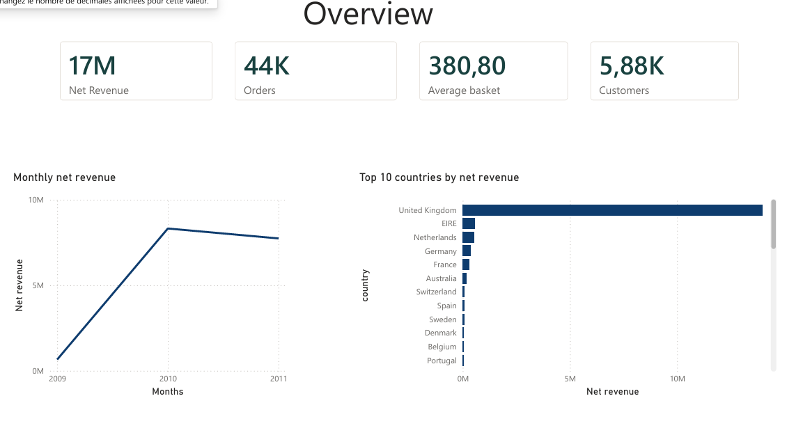

# Retail Customer Analytics

[-blue?logo=databricks&logoColor=white)](https://archive.ics.uci.edu/dataset/502/online+retail+ii)
[](https://www.python.org/)
[](https://www.sqlite.org/)
[](https://scikit-learn.org/)
[](https://lifelines.readthedocs.io/)
[](https://powerbi.microsoft.com/)

End-to-end analytics on 1,067,371 retail transactions, taken from two angles. On the customer side: data quality auditing, relational modelling in SQL, RFM segmentation, cohort retention with survival analysis, repurchase prediction, and a four-page Power BI dashboard. On the product side: a catalogue quality audit that prices the anomalies in revenue rather than in row counts.

The two sides share one dataset and one cleaning pipeline. Notebooks 01 to 05 ask who the customers are. Notebook 06 asks what is wrong with the catalogue they buy from.

---

## Objective

**Customer side, notebooks 01 to 05**

1. **Where does the revenue sit?** Which customers generate it, and how concentrated is it?
2. **How long do customers stay?** Can time-to-churn be modelled when there is no cancellation event?
3. **Who will buy again?** Can a 90-day repurchase be predicted without leaking future information?

**Product side, notebook 06**

4. **How broken is the catalogue?** How many codes are not products at all, and how many carry an inconsistent or missing label?
5. **What does it cost?** Measured in revenue exposed rather than in row counts, so that corrections can be ranked.
6. **Which products should be fixed first?** Are the best sellers affected, and which have the highest cancellation rate?

---

## Dataset

- **Name**: Online Retail II
- **Source**: [UCI Machine Learning Repository](https://archive.ics.uci.edu/dataset/502/online+retail+ii)
- **Size**: 1,067,371 transaction lines, December 2009 to December 2011, 9 variables
- **Context**: UK-based online giftware retailer, selling mostly to wholesale buyers, GBP

The raw `.xlsx` is not included in this repository (see `.gitignore`). Download `online_retail_II.xlsx` from UCI and place it in `data/raw/` before running the notebooks.

---

## Dashboard



Four pages: cohort KPIs and monthly revenue, customer concentration and ranking, product performance, and segment profiles. Full export in `dashboard/retail_dashboard.pdf`.

---

## Project Structure

```
.

├── notebooks/
│   ├── 01_data_preparation.ipynb        # quality audit, cleaning decisions, decision log
│   ├── 02_sql_modeling.ipynb            # relational schema, integrity checks, window functions
│   ├── 03_customer_segmentation.ipynb   # RFM scoring vs k-means, stability testing
│   ├── 04_cohort_retention_churn.ipynb  # cohort matrix, Kaplan-Meier, Cox regression
│   ├── 05_repurchase_prediction.ipynb   # 90-day repurchase classification
│   └── 06_catalog_quality.ipynb         # catalogue audit, revenue exposed, cancellation rate
├── dashboard/
│   ├── retail_dashboard.pbit            # Power BI template (data not embedded)
│   ├── retail_dashboard.pdf             # static export of all four pages
│   └── overview.png
├── reports/                             # figures produced by notebook 06
├── DATA_CATALOG.md                      # field dictionary, glossary, quality rules
├── BACKLOG.md                           # epics, user stories, KPIs, roadmap
├── requirements.txt
├── .gitignore
└── README.md
```

---

## Reproduce

### 1. Clone the repository

```
git clone https://github.com/juliettebm/customer-analytics-retail.git
cd customer-analytics-retail
```

### 2. Install dependencies

```
python -m venv .venv
.venv\Scripts\activate         # macOS / Linux: source .venv/bin/activate
pip install -r requirements.txt
```

### 3. Download the dataset

Download `online_retail_II.xlsx` from the [UCI repository](https://archive.ics.uci.edu/dataset/502/online+retail+ii) and place it in `data/raw/`.

### 4. Run the notebooks in order

Each notebook depends on the outputs of the previous ones:

```
jupyter notebook notebooks/01_data_preparation.ipynb
```

Run `01` → `02` → `03` → `04` → `05` for the customer side, then `06` for the product side. Notebook 06 reads the same raw file and does not depend on the outputs of 01 to 05, so it can also be run on its own. Both cache the raw Excel file as Parquet on first execution, so subsequent runs take seconds instead of minutes.

### 5. Open the dashboard

Open `dashboard/retail_dashboard.pbit` in Power BI Desktop and point it at the CSV files written by notebook 02 to `data/processed/powerbi/`. A static export is available in `dashboard/retail_dashboard.pdf`.

---

## Notebooks

### `01_data_preparation.ipynb`: Data Preparation

Quality audit before any filter is applied. Missing values are measured in revenue as well as in row count, cancellations are flagged rather than removed, and non-product stock codes are identified from their descriptions rather than guessed from a pattern.

Every exclusion is inspected against real rows: three codes (`B`, `TEST001`, `TEST002`) escape an alphabetic filter entirely and surfaced only through price-anomaly investigation.

### `02_sql_modeling.ipynb`: Relational Modelling & SQL Analysis

Decomposition into four normalised tables with primary keys, foreign keys, a domain constraint and indexes declared in SQLite. Two normalisation conflicts are resolved with deterministic tie-breaking rules: 12 customers appearing under multiple countries, and 598 stock codes carrying multiple descriptions.

Integrity is verified before loading and proved afterwards by a deliberately invalid insert that the database rejects. Analytical queries combine CTEs with `RANK`, `NTILE`, `LAG` and running totals.

### `03_customer_segmentation.ipynb`: Customer Segmentation (RFM)

Quantile-based RFM scoring and k-means clustering built in parallel, each used to validate the other. Silhouette analysis selects k = 2. Stability is tested against the two arbitrary upstream choices: reference date and cancellation-netting rule.

### `04_cohort_retention_churn.ipynb`: Cohort Retention & Churn

Acquisition cohorts, retention matrix, and time-to-churn modelled with Kaplan-Meier and Cox proportional hazards. Churn has no observable event in non-contractual retail, so the threshold is derived from the distribution of purchase intervals rather than set by convention.

The Cox model requires stratification: purchase frequency violates the proportional-hazards assumption, since it is partly determined by how long the customer survived.

### `05_repurchase_prediction.ipynb`: Repurchase Prediction

Binary classification of a 90-day repurchase, with a temporal rather than random train/test split. Every feature is computed strictly within the observation window.

### `06_catalog_quality.ipynb`: Product Catalogue Quality

The same transactions read from the product side. Non-product codes are separated from real articles by inspecting each label rather than by filtering on code format, which would have wrongly excluded 45 genuine products. Anomalies are then priced in revenue rather than counted in lines, and crossed with the best sellers to decide what to fix first.

Cancellation rate stands in for conversion, since a transactional dataset carries no page views or abandoned baskets. The field dictionary and the six quality rules are documented in `DATA_CATALOG.md`, the user stories and KPIs in `BACKLOG.md`.

---

## Key Results

### Revenue concentration

| Metric | Value |
| --- | --- |
| Revenue from the top customer decile | 63.4% |
| Customers producing half of all revenue | 271 (4.6%) |
| Revenue from the Engaged macro-cluster | 87.6% (40.3% of customers) |
| Revenue from the Champions segment | 69.4% (22.0% of customers) |

### Retention

| Metric | Value |
| --- | --- |
| Customers who never placed a second order | 27.7% |
| Median interval between consecutive orders | 25 days |
| Median customer lifetime (Kaplan-Meier) | 607 days |
| Observed churn events (180-day threshold) | 40.7% |

### Catalogue quality

| Metric | Value |
| --- | --- |
| Catalogue revenue exposed to an inconsistent label | 46% |
| Best sellers affected | 7 of the top 10 |
| Product codes carrying several different labels | 1,230 (23% of the catalogue) |
| Revenue tied to codes that are never described | none measurable |
| Non-product codes confirmed by individual inspection | 17 of 62 non-standard codes |
| Stock adjustments disguised as transactions | 3,455 lines |

Codes that are never described carry no measurable revenue. That negative result is reported as it stands: the visible catalogue gap turns out not to be the expensive one, and the label inconsistencies are.

### Repurchase prediction

| Model or reference | ROC-AUC | PR-AUC |
| --- | ---: | ---: |
| **Logistic Regression** (6 features) | **0.790** | **0.755** |
| Random Forest | 0.775 | 0.752 |
| Recency alone, no model | 0.762 | 0.685 |
| Frequency alone, no model | 0.747 | 0.698 |
| Monetary alone, no model | 0.741 | 0.695 |
| Stratified dummy | 0.497 | 0.434 |

Logistic regression outperforms the random forest on both metrics. The relationship is close enough to linear that added complexity brings nothing, and the simpler model is directly interpretable.

**The dummy is not the comparison that matters.** Its ROC-AUC is 0.5 by construction on any dataset, so 0.497 confirms the evaluation is wired correctly and nothing more. Its PR-AUC of 0.434 is the genuine no-skill value, since it sits at the base positive rate of 43.6%.

The reference the model actually has to beat is the rule a CRM team already applies by hand: rank customers on recency and contact the most recent first. That gives 0.762. The model's real contribution is therefore **2.8 points of ROC-AUC** — modest, and stated as such — but **7 points of PR-AUC**, from 0.685 to 0.755. PR-AUC is the more sensitive measure on the positive class, which is the class a campaign acts on, so that is where combining six signals earns its place.

### Cox model, time-to-churn

| Covariate | Hazard ratio | p-value |
| --- | --- | --- |
| Purchase frequency (per order) | 0.547 | < 0.0001 |
| First-order value, unstratified | 1.0000 | 0.825 |
| First-order value, stratified | 0.9999 | 0.189 |
| Country (all levels) | not significant | > 0.05 |

First-order value shows a highly significant difference between tiers by log-rank (p < 0.0001), yet no effect once purchase frequency is controlled for. The tier effect is a proxy for order frequency, not an effect of first-order spend.

---

## Methodological Notes

**Why is churn defined at 180 days?** There is no cancellation event in retail transaction data. The threshold sits between the 90th (136 days) and 95th (207 days) percentiles of observed purchase intervals. The distribution decays smoothly with no second mode, so no natural cut-off exists and any threshold is a stated convention rather than a discovered boundary.

**Why a temporal train/test split?** A random split lets the model learn from a customer's own future behaviour. The temporal split also surfaced a caveat a random split would have hidden: the positive rate is 32.2% in the training period against 43.6% in the test period, an 11-point gap attributable to the pre-Christmas peak. The test score is therefore optimistic as a year-round estimate.

The same caveat carries over to the decile lift. Lift is a ratio, so it is less sensitive to the level of the base rate than AUC is, but it is still measured on one window, and an atypical one. Nothing here establishes that a lift of 2.08 holds in February. Settling that would take a rolling-origin evaluation across several cut-off dates, which this single-window split cannot provide.

**Why stratify the Cox model?** `NPurchases` counts purchases across the whole observation period, so it is partly determined by how long the customer survived. It is closer to an outcome than to a fixed baseline characteristic, which is precisely when the proportional-hazards assumption breaks down.

**Why keep cancellations in the base table?** Netting them is correct for customer monetary value but wrong for behavioural analysis. They are flagged in notebook 01 and each downstream notebook decides explicitly, rather than inheriting a silent exclusion.

**Why report negative results?** First-order value does not predict retention once frequency is controlled for, and the threshold optimisation in notebook 05 is degenerate under the assumed costs. Both are reported as they stand: a negative result obtained twice rules out a targeting criterion rather than merely failing to establish it.

---

## Limitations

Guest transactions are out of scope. 22.77% of rows carry no customer identifier and are excluded, so every customer-level metric describes identified customers only, biased towards higher-value repeat buyers.

12.9% of observed purchase intervals are same-day, likely split orders rather than genuine repeat purchases. No field distinguishes them, so they are retained.

The dataset ends on 9 December 2011. The final month is incomplete and the last cohorts are observed for a few weeks only.

---

## Stack

Python 3.x · pandas · numpy · scikit-learn · lifelines · matplotlib · seaborn · SQLite · Power BI

---

## License

Released under the [MIT License](LICENSE). The *Online Retail II* dataset is distributed by the UCI Machine Learning Repository under its own [terms of use](https://archive.ics.uci.edu/dataset/502/online+retail+ii); it is downloaded separately and not redistributed here.

---

## Author

**Juliette Bouli-Mengue**
M2 Data Science, Université de Lille
[GitHub](https://github.com/juliettebm)
